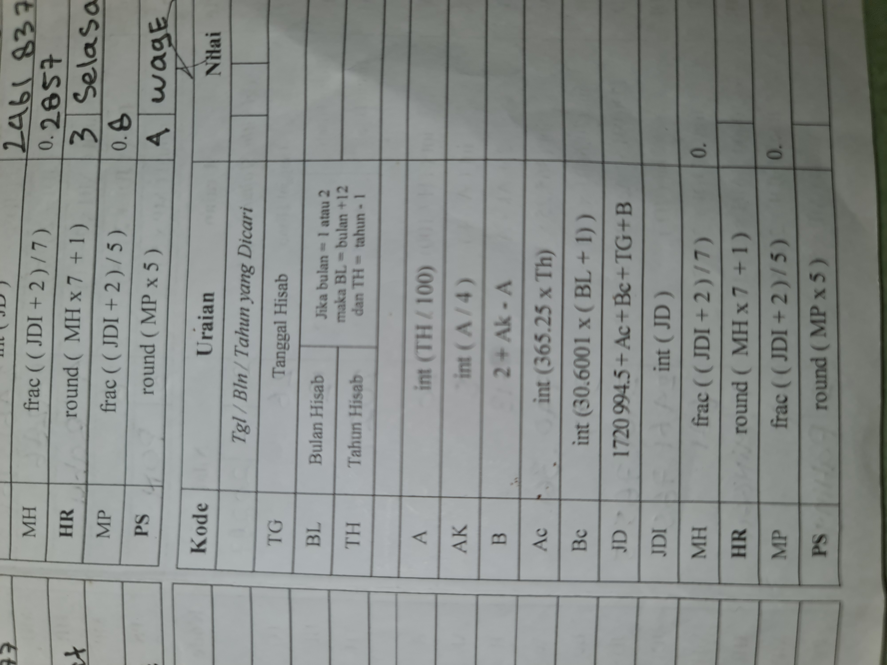

# Hitung_pasaran
Menghitung / mencari pasaran dgn cepat lgkap d3ngan rumus penghitungannya
rumus di ambil dari kitab inkasyaf al hisab karya gus faizin
dari dari ponpes darussaadah
## Tujuan
•memudahkan untuk menghitung atau mencarai hari pasaran
•mengetahui alur penghitungan nya karena di sertai rumus lengkap di bawah nya
## dasar rumus

## cara menggunakan
1. unduh aplikasi dari github release di bawah
2. install aplikasi cari pasaran
3. buka aplikasi cari pasaran
4. masukan tanggal bulan dan tahun yg akan anda cari

5. tekan tombol [HITUNG HARI & PASARAN]

 By: akmalnbl
